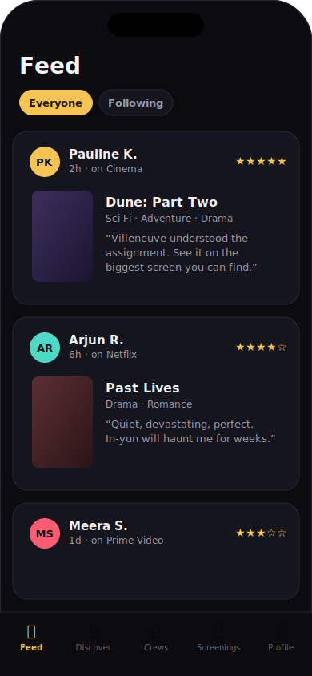
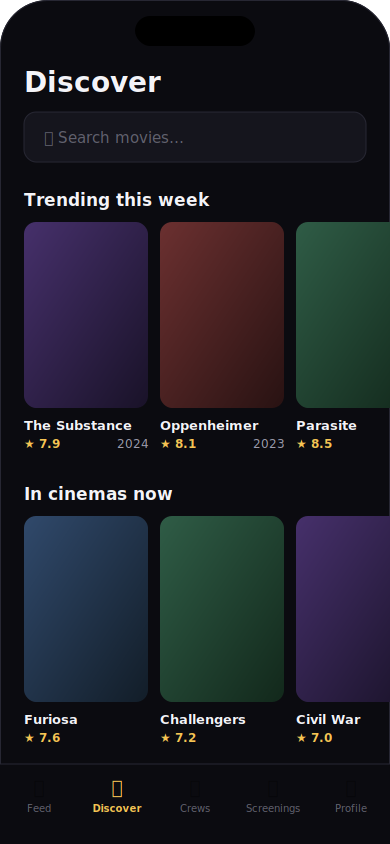
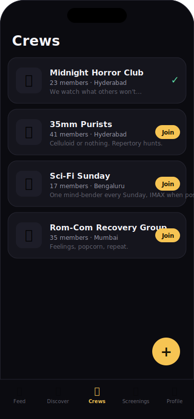
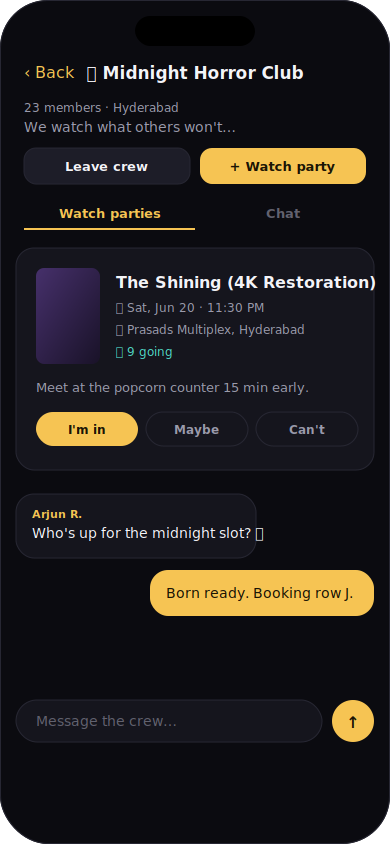
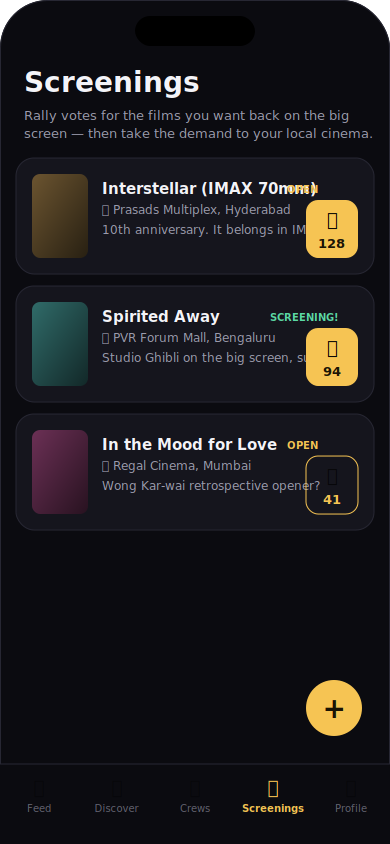
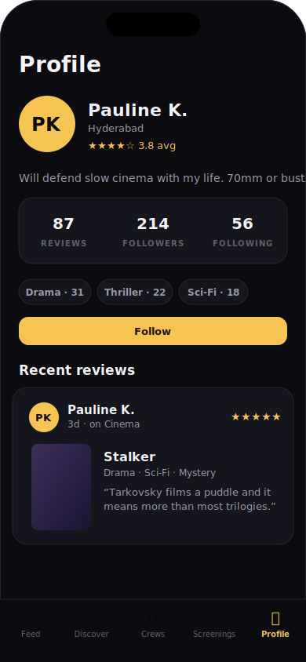

# 🎬 CinePool Palace

**The social network for cinephiles.** Share the films worth watching, build a taste profile people follow you for, form crews that watch movies together at the cinema — and when your city's screens are missing a classic, campaign to bring it back.

Built with **Expo (React Native + TypeScript)** on the frontend and **Supabase** as the entire backend — auth, Postgres, row-level security, realtime chat and edge functions, all on the free tier. There is no server to maintain or pay for.

---

## ✨ What it does

| | Feature | How it works |
|---|---|---|
| ⭐ | **Rate & review** | Log any film (search powered by TMDB), rate it 1–5 stars, say where you watched it. Every review is a post in the social feed. |
| 👤 | **Taste profiles** | Your ratings build a public profile: review count, average score, top genres. People follow you *for your taste*. |
| 📰 | **Feed** | A poster-led feed of reviews — switch between *Everyone* and *Following*. |
| 👥 | **Crews** | Create or join movie groups. Each crew has realtime chat and shared plans. |
| 🍿 | **Watch parties** | A crew picks a film, a cinema and a time. Members RSVP, watch together, then argue about it in chat. |
| 🎟️ | **Screening campaigns** | Want *Interstellar* back in IMAX? Open a request for a cinema in your city, gather 🔥 votes, and take the demand to the cinema. |

## 📱 App screens

| Feed | Discover | Crews |
|---|---|---|
|  |  |  |

| Crew & watch party | Screenings | Taste profile |
|---|---|---|
|  |  |  |

## 🏗 Architecture

```
┌─────────────────────────────────────────────┐
│   Expo app (React Native + TypeScript)      │
│   expo-router · expo-image · realtime UI    │
└──────────────────┬──────────────────────────┘
                   │  @supabase/supabase-js
┌──────────────────▼──────────────────────────┐
│                Supabase (free tier)         │
│  Auth          email/password sessions      │
│  Postgres      profiles · reviews · follows │
│                crews · parties · screenings │
│  RLS           every table policy-guarded   │
│  Realtime      crew chat subscriptions      │
│  Edge function tmdb-proxy (keeps TMDB key   │
│                server-side)                 │
└──────────────────┬──────────────────────────┘
                   │
            ┌──────▼──────┐
            │  TMDB API   │  movie data & posters
            └─────────────┘
```

**Repo layout**

```
app/                  # screens (expo-router file-based routing)
  (auth)/             # sign-in, sign-up
  (tabs)/             # feed, discover, crews, screenings, profile
  movie/[id]          # movie detail
  crew/[id]           # crew detail: watch parties + realtime chat
  review/[movieId]    # log & review modal
  party/new           # plan a watch party
  screening/new       # start a screening campaign
src/
  api/                # all Supabase queries (profiles, reviews, crews, screenings)
  components/         # design system + feature cards
  lib/                # supabase client, TMDB client (via edge proxy)
  providers/          # auth/session context
  theme/              # colors, spacing, typography
supabase/
  migrations/         # full SQL schema + RLS policies
  functions/          # edge functions (tmdb-proxy, movie-chat, suggestions)
docs/screens/         # the screen mockups above
```

## 🚀 Getting started

### 1. Clone & install

```sh
git clone https://github.com/SonuKanna7789/cinepool-palace.git
cd cinepool-palace
npm install
```

### 2. Set up Supabase (free)

1. Create a project at [supabase.com](https://supabase.com) (free tier is plenty).
2. Copy `.env.example` to `.env` and fill in your project URL and anon key (Project Settings → API).
3. Apply the schema — in the **SQL Editor**, run these two files **in order**:

   1. [`supabase/migrations/20260611080000_base_schema.sql`](supabase/migrations/20260611080000_base_schema.sql) — profiles, movies, reviews, preferences + auto-profile trigger
   2. [`supabase/migrations/20260611090000_social_layer.sql`](supabase/migrations/20260611090000_social_layer.sql) — follows, crews, chat, watch parties, screening campaigns

   Both are idempotent (safe to re-run). Or apply them with the CLI:

   ```sh
   npx supabase login
   npx supabase link --project-ref <your-project-ref>
   npx supabase db push
   ```

4. (For movie search) get a free [TMDB API key](https://www.themoviedb.org/settings/api), then deploy the proxy and set the secret:

   ```sh
   npx supabase functions deploy tmdb-proxy
   npx supabase secrets set TMDB_API_KEY=<your-tmdb-key>
   ```

### 3. Run the app

```sh
npx expo start
```

Scan the QR code with **Expo Go** ([iOS](https://apps.apple.com/app/expo-go/id982107779) / [Android](https://play.google.com/store/apps/details?id=host.exp.exponent)) — or press `i` / `a` for a simulator, `w` for the browser.

## 💸 Hosting — free, nothing to deploy

The "backend" is Supabase itself, so there is no server of your own:

- **Database, auth, realtime, storage** — Supabase free tier (500 MB DB, 50k monthly active users).
- **Edge functions** — deployed to Supabase with one CLI command, 500k invocations/month free.
- **Movie data** — TMDB API, free for non-commercial use.
- **App distribution** — [EAS Build](https://docs.expo.dev/build/introduction/) free tier produces installable iOS/Android builds; or ship instantly via Expo Go during development.

## 🔒 Security model

Every table is protected by Postgres **row-level security**:

- Profiles and public reviews are readable by all signed-in users (it's a social network).
- You can only write rows as yourself (`auth.uid()` checks on every insert/update/delete).
- Crew chat is readable and writable by crew members only.
- The TMDB API key never ships in the app — requests go through the `tmdb-proxy` edge function.

## 🧰 Tech stack

- [Expo SDK 56](https://expo.dev) / React Native 0.85 / React 19 / TypeScript (strict)
- [expo-router](https://docs.expo.dev/router/introduction/) — file-based navigation, typed routes
- [Supabase](https://supabase.com) — Postgres, Auth, RLS, Realtime, Edge Functions
- [TMDB](https://www.themoviedb.org) — movie metadata & posters

## 🗺 Roadmap ideas

- Push notifications for party RSVPs and new followers (expo-notifications)
- AI-powered "what should we watch?" picker for crews (the `movie-chat` edge function is already in the repo)
- Cinema-side dashboard so theatres can browse and accept screening campaigns
- Letterboxd import

---

Made with 🍿 for people who stay through the credits.
